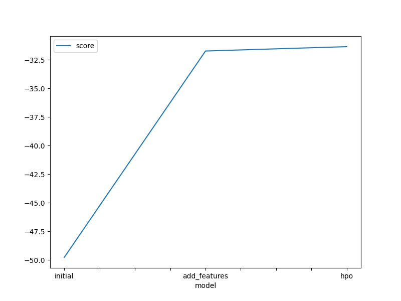
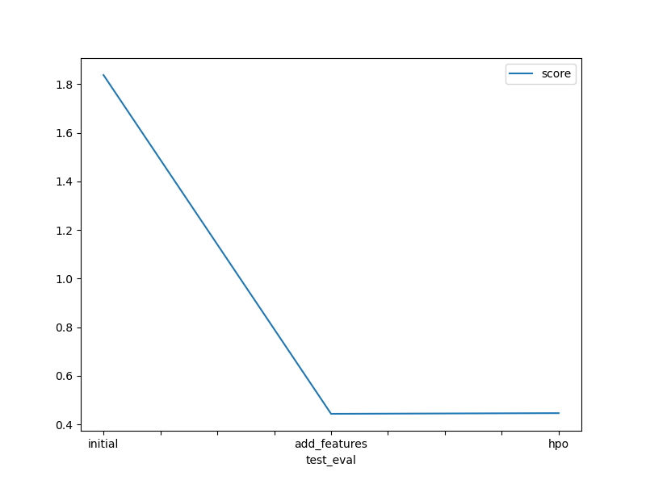

# Report: Predict Bike Sharing Demand with AutoGluon Solution
#### Margaret Chan

## Initial Training
### What did you realize when you tried to submit your predictions? What changes were needed to the output of the predictor to submit your results?

The predictions are floating point numbers, I had to convert them to integers.

### What was the top ranked model that performed?

'WeightedEnsemble_L3' (RMSE: -49.773130, Kaggle score: 1.83797)

## Exploratory data analysis and feature creation
### What did the exploratory analysis find and how did you add additional features?

I see:

1. high correlation between 'temp' and 'atemp'
2. high correlation between 'datetime'.month and 'season'
3. holiday is unbalanced, mostly 0

But i didn't leverage that finding, and just followed the directions, and only changed 2 things:

1. create derived features ('year', 'month', 'day', 'dayofweek', 'hour') from 'datetime', basically adding an extra feature 'hour'  than what AutoGluon would do by default, and then drop 'datetime'
2. explicitly tell AutoGluon that these 2 features ('season', 'weather') are categorical

### How much better did your model preform after adding additional features and why do you think that is?

The best performing model is still 'WeightedEnsemble_L3' (RMSE: -31.724897, Kaggle score: 0.44354)
but it has performed much better than the last round (improvement: RMSE: 36%, Kaggle score: 76%)
it's performing better because we're giving more info to AutoGluon and the models

## Hyper parameter tuning
### How much better did your model preform after trying different hyper parameters?

My experiment was to bump the num_bag_folds from 8 to 10, and doubled the time_limit, not only has the performance not improved, but it has actually performed slightly worse. 

### If you were given more time with this dataset, where do you think you would spend more time?

feature engineering, and leave the heavy lifting hyperparameter tuning stacking bagging boosting ensembling experiments to AutoGluon, especially when I do not even know how to tune.

1. we have 2 pairs of highly correlated features, I would probably experiment with dropping one from each pair
2. I would also try dropping 'holiday' as the values are almost the same throughout
3. we are given data for the first half (ok 19 days) of the month, and asked to predict the count for the rest of the month, would it be possible to devise a new feature which can possibly tell us about the rest of the month 

### Create a table with the models you ran, the hyperparameters modified, and the kaggle score.
|model|hpo1|hpo2|hpo3|score|
|--|--|--|--|--|
|initial|{presets='best_quality'}|{time_limit=600}|{num_bag_folds=8}|1.83797|
|add_features|{presets='best_quality'}|{time_limit=600}|{num_bag_folds=8}|0.44354|
|hpo|{presets='medium_quality'}|{time_limit=1200}|{num_bag_folds=10}|0.44636|

### Create a line plot showing the top model score for the three (or more) training runs during the project.

### Create a line plot showing the top kaggle score for the three (or more) prediction submissions during the project.

## Summary

Not just for this project, but in general, AutoML is very useful, so we can focus on data preparation, and feature engineering.  
